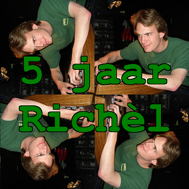
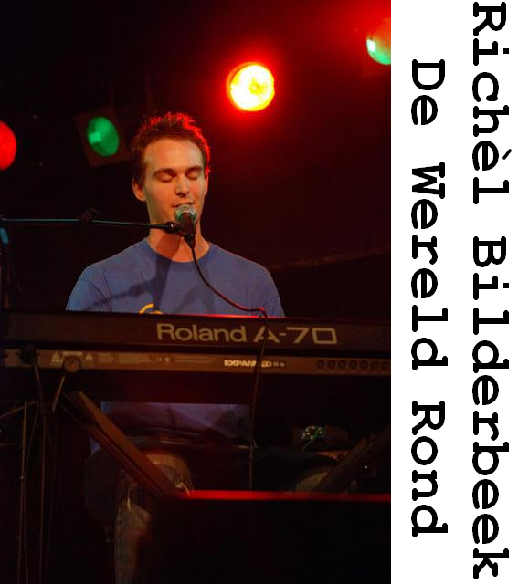
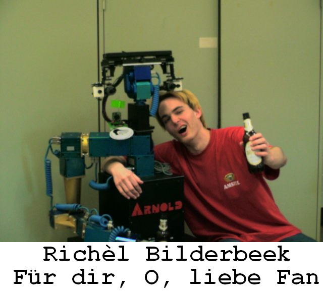
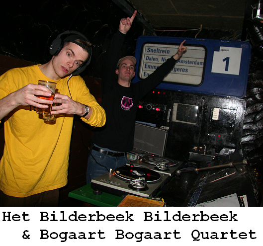

# RichelBilderbeekReviews

Branch|[](https://travis-ci.org)
---|---
master|[](https://travis-ci.org/richelbilderbeek/RichelBilderbeekReviews)

Reviews of all Richel Bilderbeek's songs

## CD 7: Ik Zing Alleen Voor De Koningin

```
No coverart yet
```

## CD 6: Vijf Jaar Richel



## CD 5: De Wereld Rond



## CD 4: Fuer Dir, O, Liebe Fan



## CD 3: Richeldingen


## CD 2: Dingen Voor 2004


 * 01. [Al Heb Je Blauw Haar](AlHebJeBlauwHaar.md)
 * 02. [Come Home Darling](ComeHomeDarling.md)
 * 03. Eerste Signaal
 * 04. [Het Koffielied](HetKoffielied.md) 
 * 05. [Het Leven Is Naar](HetLevenIsNaar.md) 
 * 06. [Het N..kmenslied](HetNeukmenslied.md) 
 * 07. Russisch Liedje 
 * 08. [Wooloo Mooloo](WoolooMooloo.md) 


## CD 1: Bilderbeek, Bilderbeek & Bogaart Bogaart Quartet



 01. [Ode Aan Masculiniteit (vocaal)](OdeAanMasculiniteit.md)
 02. [Maanliedje](Maanliedje.md)
 03. [Het Koffielied](HetKoffielied.md)
 04. [Grote Gele Sinaasappel](GroteGeleSinaasappel.md)
 05. [Ode Aan Masculiniteit](OdeAanMasculiniteit.md)
 06. [Maanliedje (remix)](Maanliedje.md)
 07. [Het Koffielied (remix)](HetKoffielied.md)
 08. [Grote Gele Sinaasappel (remix)](GroteGeleSinaasappel.md)
 09. [Ode Aan Masculiniteit (remix)](OdeAanMasculiniteit.md)
 10. [Hendrik (vocaal)](Hendrik.md)
